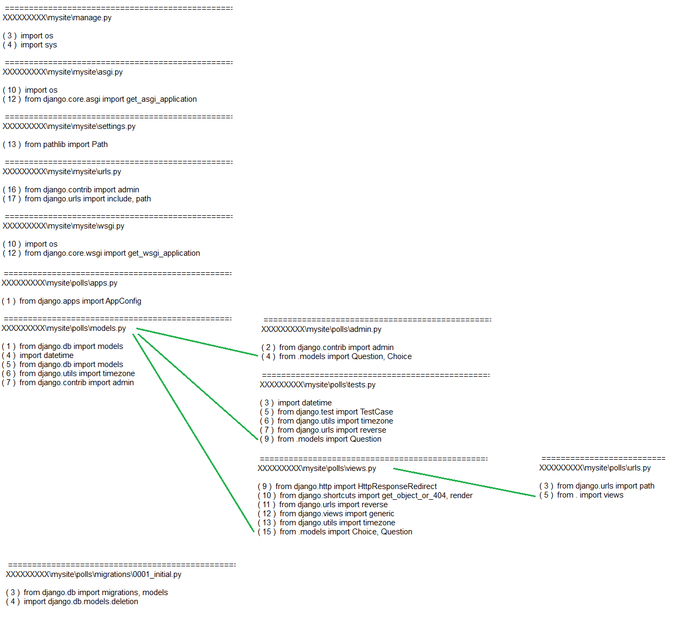

The script reveals relations between files in specified directory.
Depending on the selected regular expression, it outputs lines (starting with line number) that contain a word "import",
or also those that contain constructions like "parent.child(.child...)"

Note 1: if the names of imported modules are placed on strings below the string that
contains the word "import", they will not be detected.  
Note 2: Filenames ('name.extension') also match the regexp pattern (like 'parent.child'), so they also get into the output (should be erased manually if needed).

Settings and explanatory notes can be found between    
'######### (Settings - begin:) #########'  
and  
'######### (Settings - end) #########',  
and no changes should be made to the code outside them.

The script is a single file which can be put inside a project (or anywhere else if appropriate settings are made).
It has no dependencies, so no additions to virtual environment are required.
All imported modules are standard.
The script works well at least for python versions 3.7 through 3.10.


For example, for the project from django tutorial (https://docs.djangoproject.com/en/3.2/intro/tutorial01/ ... https://docs.djangoproject.com/en/3.2/intro/tutorial07) 
the dependencies might be arranged this way (in Paint program, or by hand, after printing out to paper):



Here, the first column contains information about files that do not refer to any files in current project,
and further relations are shown with green lines (manually).

The most full output looks like the one below.


```

 ==================================================================== 
XXXXXXXXX\mysite\manage.py 

( 3 )  import os
( 4 )  import sys
( 9 )      os.environ.setdefault( DJANGO_SETTINGS_MODULE ,  mysite.settings )
( 11 )          from django.core.management import execute_from_command_line
( 12 )      except ImportError as exc:
( 13 )          raise ImportError(
( 14 )               Couldn t import Django. Are you sure it s installed and  
( 18 )      execute_from_command_line(sys.argv)

 ==================================================================== 
XXXXXXXXX\mysite\__init__.py 


 ==================================================================== 
XXXXXXXXX\mysite\mysite\asgi.py 

( 10 )  import os
( 12 )  from django.core.asgi import get_asgi_application
( 14 )  os.environ.setdefault( DJANGO_SETTINGS_MODULE ,  mysite.settings )

 ==================================================================== 
XXXXXXXXX\mysite\mysite\settings.py 

( 13 )  from pathlib import Path
( 16 )  BASE_DIR = Path(__file__).resolve().parent.parent
( 33 )       polls.apps.PollsConfig ,
( 34 )       django.contrib.admin ,
( 35 )       django.contrib.auth ,
( 36 )       django.contrib.contenttypes ,
( 37 )       django.contrib.sessions ,
( 38 )       django.contrib.messages ,
( 39 )       django.contrib.staticfiles ,
( 43 )       django.middleware.security.SecurityMiddleware ,
( 44 )       django.contrib.sessions.middleware.SessionMiddleware ,
( 45 )       django.middleware.common.CommonMiddleware ,
( 46 )       django.middleware.csrf.CsrfViewMiddleware ,
( 47 )       django.contrib.auth.middleware.AuthenticationMiddleware ,
( 48 )       django.contrib.messages.middleware.MessageMiddleware ,
( 49 )       django.middleware.clickjacking.XFrameOptionsMiddleware ,
( 52 )  ROOT_URLCONF =  mysite.urls 
( 56 )           BACKEND :  django.template.backends.django.DjangoTemplates ,
( 61 )                   django.template.context_processors.debug ,
( 62 )                   django.template.context_processors.request ,
( 63 )                   django.contrib.auth.context_processors.auth ,
( 64 )                   django.contrib.messages.context_processors.messages ,
( 70 )  WSGI_APPLICATION =  mysite.wsgi.application 
( 78 )           ENGINE :  django.db.backends.sqlite3 ,
( 79 )           NAME : BASE_DIR /  db.sqlite3 ,
( 89 )           NAME :  django.contrib.auth.password_validation.UserAttributeSimilarityValidator ,
( 92 )           NAME :  django.contrib.auth.password_validation.MinimumLengthValidator ,
( 95 )           NAME :  django.contrib.auth.password_validation.CommonPasswordValidator ,
( 98 )           NAME :  django.contrib.auth.password_validation.NumericPasswordValidator ,
( 125 )  DEFAULT_AUTO_FIELD =  django.db.models.BigAutoField 

 ==================================================================== 
XXXXXXXXX\mysite\mysite\urls.py 

( 16 )  from django.contrib import admin
( 17 )  from django.urls import include, path
( 20 )      path( polls/ , include( polls.urls )),
( 21 )      path( admin/ , admin.site.urls),

 ==================================================================== 
XXXXXXXXX\mysite\mysite\wsgi.py 

( 10 )  import os
( 12 )  from django.core.wsgi import get_wsgi_application
( 14 )  os.environ.setdefault( DJANGO_SETTINGS_MODULE ,  mysite.settings )

 ==================================================================== 
XXXXXXXXX\mysite\mysite\__init__.py 


 ==================================================================== 
XXXXXXXXX\mysite\polls\admin.py 

( 2 )  from django.contrib import admin
( 4 )  from .models import Question, Choice
( 38 )  class ChoiceInline(admin.TabularInline):     #                 
( 42 )  class QuestionAdmin(admin.ModelAdmin):
( 52 )  admin.site.register(Question, QuestionAdmin)

 ==================================================================== 
XXXXXXXXX\mysite\polls\apps.py 

( 1 )  from django.apps import AppConfig
( 5 )      default_auto_field =  django.db.models.BigAutoField 

 ==================================================================== 
XXXXXXXXX\mysite\polls\models.py 

( 1 )  from django.db import models
( 4 )  import datetime
( 5 )  from django.db import models
( 6 )  from django.utils import timezone
( 7 )  from django.contrib import admin
( 10 )  class Question(models.Model):
( 11 )      question_text = models.CharField(max_length=200)
( 12 )      pub_date = models.DateTimeField( date published )
( 15 )          return self.question_text
( 17 )      @admin.display(boolean=True, ordering= pub_date , description= Published recently? , )
( 23 )          now = timezone.now()
( 24 )          return now - datetime.timedelta(days=1) <= self.pub_date <= now
( 29 )  class Choice(models.Model):
( 30 )      question = models.ForeignKey(Question, on_delete=models.CASCADE)
( 31 )      choice_text = models.CharField(max_length=200)
( 32 )      votes = models.IntegerField(default=0)
( 34 )          return self.choice_text

 ==================================================================== 
XXXXXXXXX\mysite\polls\tests.py 

( 3 )  import datetime
( 5 )  from django.test import TestCase
( 6 )  from django.utils import timezone
( 7 )  from django.urls import reverse
( 9 )  from .models import Question
( 18 )      time = timezone.now() + datetime.timedelta(days=days)
( 19 )      return Question.objects.create(question_text=question_text, pub_date=time)
( 29 )          time = timezone.now() + datetime.timedelta(days=30)
( 31 )          self.assertIs(future_question.was_published_recently(), False)
( 38 )          time = timezone.now() - datetime.timedelta(days=1, seconds=1)
( 40 )          self.assertIs(old_question.was_published_recently(), False)
( 47 )          time = timezone.now() - datetime.timedelta(hours=23, minutes=59, seconds=59)
( 49 )          self.assertIs(recent_question.was_published_recently(), True)
( 57 )          response = self.client.get(reverse( polls:index ))
( 58 )          self.assertEqual(response.status_code, 200)
( 59 )          self.assertContains(response,  No polls are available. )
( 60 )          self.assertQuerysetEqual(response.context[ latest_question_list ], [])
( 68 )          response = self.client.get(reverse( polls:index ))
( 69 )          self.assertQuerysetEqual(
( 70 )              response.context[ latest_question_list ],
( 80 )          response = self.client.get(reverse( polls:index ))
( 81 )          self.assertContains(response,  No polls are available. )
( 82 )          self.assertQuerysetEqual(response.context[ latest_question_list ], [])
( 91 )          response = self.client.get(reverse( polls:index ))
( 92 )          self.assertQuerysetEqual(
( 93 )              response.context[ latest_question_list ],
( 103 )          response = self.client.get(reverse( polls:index ))
( 104 )          self.assertQuerysetEqual(
( 105 )              response.context[ latest_question_list ],
( 116 )          url = reverse( polls:detail , args=(future_question.id,))
( 117 )          response = self.client.get(url)
( 118 )          self.assertEqual(response.status_code, 404)
( 126 )          url = reverse( polls:detail , args=(past_question.id,))
( 127 )          response = self.client.get(url)
( 128 )          self.assertContains(response, past_question.question_text

 ==================================================================== 
XXXXXXXXX\mysite\polls\urls.py 

( 3 )  from django.urls import path
( 5 )  from . import views
( 31 )      path(  , views.IndexView.as_view(), name= index ),
( 32 )      path( <int:pk>/ , views.DetailView.as_view(), name= detail ),
( 33 )      path( <int:pk>/results/ , views.ResultsView.as_view(), name= results ),
( 34 )      path( <int:question_id>/vote/ , views.vote, name= vote ),

 ==================================================================== 
XXXXXXXXX\mysite\polls\views.py 

( 9 )  from django.http import HttpResponseRedirect
( 10 )  from django.shortcuts import get_object_or_404, render
( 11 )  from django.urls import reverse
( 12 )  from django.views import generic
( 13 )  from django.utils import timezone
( 15 )  from .models import Choice, Question
( 19 )  class IndexView(generic.ListView):     #                                    
( 20 )      template_name =  polls/index.html 
( 31 )          return Question.objects.filter(pub_date__lte=timezone.now()).order_by( -pub_date )[:5]
( 34 )  class DetailView(generic.DetailView):  #                                                        
( 36 )      template_name =  polls/detail.html 
( 42 )          return Question.objects.filter(pub_date__lte=timezone.now())
( 45 )  class ResultsView(generic.DetailView):  #                                                        
( 47 )      template_name =  polls/results.html 
( 53 )          selected_choice = question.choice_set.get(pk=request.POST[ choice ])
( 54 )      except (KeyError, Choice.DoesNotExist):
( 59 )          return render(request,  polls/detail.html , {
( 66 )          selected_choice.votes += 1
( 67 )          selected_choice.save()
( 71 )          return HttpResponseRedirect(reverse( polls:results , args=(question.id,)))

 ==================================================================== 
XXXXXXXXX\mysite\polls\__init__.py 


 ==================================================================== 
XXXXXXXXX\mysite\polls\migrations\0001_initial.py 

( 3 )  from django.db import migrations, models
( 4 )  import django.db.models.deletion
( 7 )  class Migration(migrations.Migration):
( 15 )          migrations.CreateModel(
( 18 )                  ( id , models.BigAutoField(auto_created=True, primary_key=True, serialize=False, verbose_name= ID )),
( 19 )                  ( question_text , models.CharField(max_length=200)),
( 20 )                  ( pub_date , models.DateTimeField(verbose_name= date published )),
( 23 )          migrations.CreateModel(
( 26 )                  ( id , models.BigAutoField(auto_created=True, primary_key=True, serialize=False, verbose_name= ID )),
( 27 )                  ( choice_text , models.CharField(max_length=200)),
( 28 )                  ( votes , models.IntegerField(default=0)),
( 29 )                  ( question , models.ForeignKey(on_delete=django.db.models.deletion.CASCADE, to= polls.question )),

 ==================================================================== 
XXXXXXXXX\mysite\polls\migrations\__init__.py 


 ==================================================================== 
XXXXXXXXX\mysite\polls\templates\polls\detail.html 

( 14 )      <h3> question.id = {{ question.id }}</h3>
( 15 )      <h1>{{ question.question_text }}</h1>
( 16 )      <h2>{{ question.pub_date }}</h2> <!-- zaodno dobavlu-->
( 19 )          <!-- a eto neponiatno -->
( 20 )          <li>{{ choice.choice_text }}</li>         <!-- my chto li k tablize choice obraschaemsya? - NET -->
( 28 )      <form action=   method= post >
( 33 )          <legend><h1>{{ question.question_text }}</h1></legend>
( 36 )          
( 37 )              <!--  <h6> {{ forloop.counter }} </h6>  -->
( 38 )              <input type= radio  name= choice  id= choice{{ forloop.counter }}  value= {{ choice.id }} >
( 39 )              <label for= choice{{ forloop.counter }} >{{ choice.choice_text }}</label><br>

 ==================================================================== 
XXXXXXXXX\mysite\polls\templates\polls\index.html 

( 7 )      <link rel= stylesheet  type= text/css  href=  >
( 15 )              <!-- <li><a href= /polls/{{ question.id }}/ >{{ question.question_text }}</a></li>  -->
( 19 )              <li><a href=  >{{ question.question_text }}</a></li>

 ==================================================================== 
XXXXXXXXX\mysite\polls\templates\polls\results.html 

( 8 )      <h1>{{ question.question_text }}</h1>
( 11 )      
( 12 )          <li>{{ choice.choice_text }} -- {{ choice.votes }} vote{{ choice.votes|pluralize }}</li>
( 16 )      <a href=  >Vote again?</a>

 ==================================================================== 
XXXXXXXXX\mysite\templates\admin\base_site.html 

( 1 )  

```